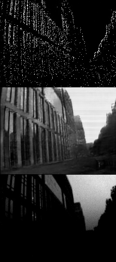

# DVS-Dark

Implementation of ECCV2020 paper "Learning to See in the Dark with Events"
# Run

virtualenv -p /usr/bin/python2.7 Dark-venv \
source Dark-venv/bin/activate \
pip install -r requiresments.txt \
sh scripts/test.sh
# Results

Results will be saved at "result/eval_FX2G/"

The first line is the visual representation of the event frame, the second line is our reconstruction result, and the third line is the intensity image

